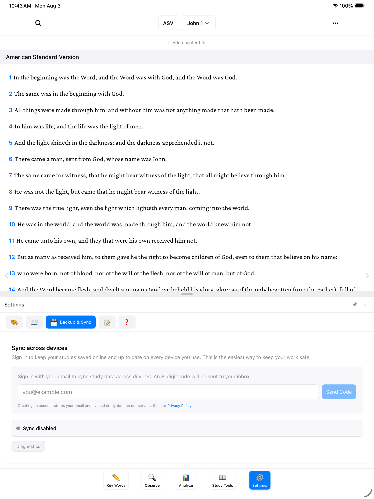

If you use BibleMarker on more than one device — say, a tablet at home and a phone in your bag — an account keeps your markings and notes the same on both. This guide shows you how to sign in, what gets synced, and how to sign out again.

## Do you need an account?

No. Everything in BibleMarker works without one — reading, marking key words, taking notes, all of it. Your work is saved right on your device, and you never need an internet connection to study.

An account is only useful for one thing: keeping your work in sync between two or more devices. If you study on a single device, you can skip this page entirely and come back if that ever changes.

> **Don't worry:** Signing in doesn't move or change anything you've already done. All your markings stay exactly where they are.

## Sign in with your email

There's no password to invent and no password to forget. BibleMarker signs you in with your email address and a short code it sends you. Here's how:

1. Tap **Settings** (⚙️) — the last of the five buttons along the bottom of the screen.
2. Tap **Backup & Sync**.
3. Find the section called **Sync across devices**.
4. Type your email address into the box and send it off.

5. Now open your email — on this device or any other. You'll find a message from BibleMarker containing an **8-digit code**.
6. Come back to BibleMarker and type in those eight digits. That's it — you're signed in.

> **Tip:** The code is like a key that works once and then melts. If it doesn't arrive after a minute or two, check your junk or spam folder, or simply ask the app to send a fresh one.

To sync a second device, do the same steps there with the same email address. Once both devices are signed in, they quietly keep each other up to date whenever they're connected to the internet.

## What syncs

When you're signed in, BibleMarker keeps these in step across your devices:

- Your **studies**
- Your **key words** and their colors and symbols
- Your **notes**
- Your **observations** — lists, people, places, and time expressions

One thing that does *not* sync: the Bible translations you've downloaded. Those are big files, so each device downloads its own copy from **Settings** → **Bible**. Your markings will still appear in the right places either way.

Creating an account stores your email address and your synced study data on the developer's servers — nothing else.

## Signing out and removing your account

Both live in the same place you signed in: **Settings** (⚙️) → **Backup & Sync**, in the **Sync across devices** section.

- **Sign out** stops syncing on this device. Your studies stay on the device — nothing is deleted.
- **Delete Account** removes your account and your synced data from the servers. Use this if you decide you no longer want anything stored online.

> **Tip:** Even without an account, you can keep your work safe with a backup file. See [Settings & Backups](/docs/settings-and-backups/) for how.
