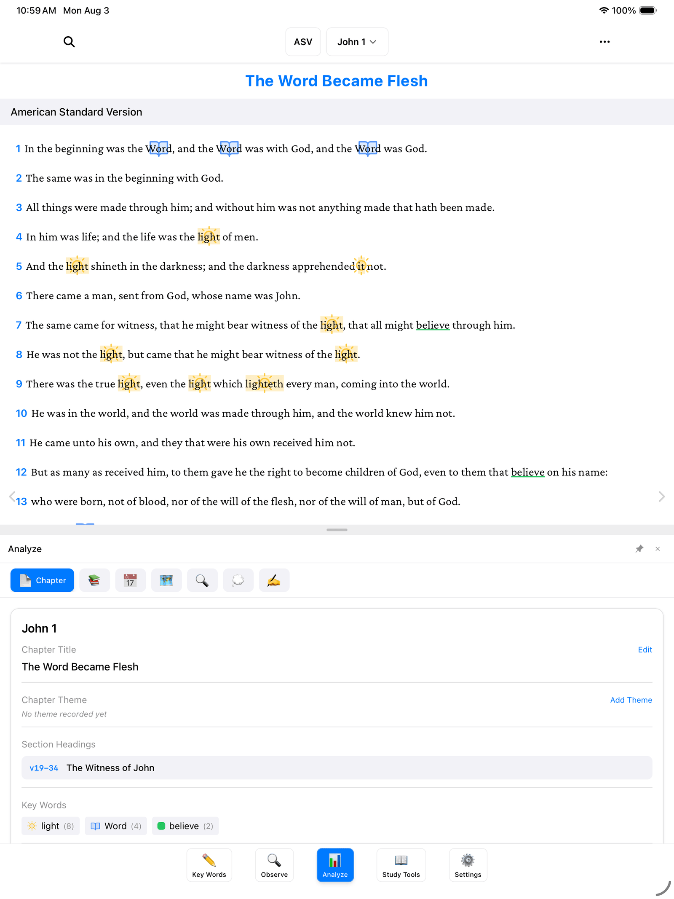
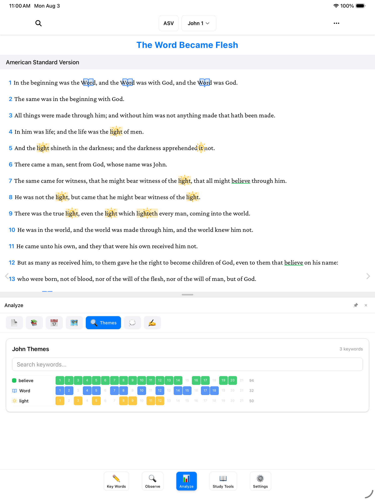
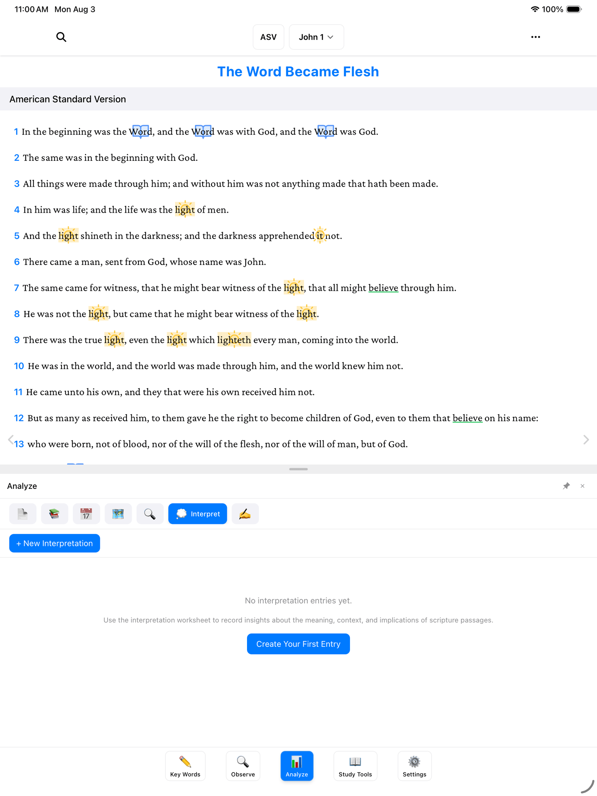

After a while of marking and note-taking, your chapters start to fill up with color — just like a well-loved paper Bible. The **Analyze** panel is where you step back from the page and look at the whole book from above: every mark, every theme, every place and date, gathered into one view. It's also where the study turns personal, with room to write what the passage *means* and what you'll *do* about it.

Tap **Analyze** (📊) — the third of the five buttons along the bottom of the screen. A row of tabs appears across the top: **Chapter**, **Overview**, **Timeline**, **Places**, **Themes**, **Interpret**, and **Apply**. Let's take a short walk through each one.

> **Tip:** On a computer, pressing the number **3** opens the Analyze panel straight away.

## Chapter — this chapter at a glance

The **Chapter** tab is a summary card for the chapter you're reading. In one glance you can see:

- The **Chapter Title** you've given it — like writing a heading at the top of a notebook page. Tap **Edit** to change it.
- The **Chapter Theme** — the one big idea, added with **Add Theme**.
- Your **Section Headings** — the smaller headings you've placed through the chapter.
- Your **Key Words**, each with a count of how many times it appears in this chapter.

Those counts are worth a look on their own. In John 1, "light" appears 8 times — the text is telling you what it cares about, and the numbers make it plain.

## Overview — the whole book

The **Overview** tab widens the lens from one chapter to the whole book: your chapter titles and themes lined up in order, like a table of contents you wrote yourself. Skim down it and the shape of the book starts to show.

## Timeline — events in order

Remember the dates you added to people, and the time expressions you gathered in the [Observe panel](/docs/people-places-time/)? The **Timeline** tab lays them out in order, so you can see when things happened and how they relate.

## Places — where it all happened

The **Places** tab gathers every place you've recorded across the book into one view — the whole journey in one place, instead of scattered across chapters.

## Themes — your key words from above

This one is the star of the panel. The **Themes** tab shows a grid: your key words down one side, every chapter of the book across the top, and a mark wherever a key word appears in a chapter.

Imagine laying all 21 chapters of your marked-up Bible on the floor and looking down at them from above — that's what this grid gives you. In John, you can watch "light" burn bright in the early chapters, and "believe" run like a thread through the whole book. Patterns you'd never spot one page at a time are suddenly right there.

## Interpret — what does it mean?

Observation asks *what does it say?* The **Interpret** tab asks the next question: *what does it mean?* It's a worksheet — blank lined paper for your conclusions about the meaning, the context, and the implications of what you've observed.

The first time you open it, it will say "No interpretation entries yet" and invite you to record insights about the meaning, context, and implications. Tap **Create Your First Entry** (or **New Interpretation**) and write in your own words. There's no format to follow and no wrong answer — these are your notes, and you can revise them any time.

## Apply — what will I do about it?

The **Apply** tab is a matching worksheet for the final question: *what will I do about it?* Study that stays on the page isn't finished. This is where you write down how the passage should change your week — same simple format as Interpret, just pointed at your own life.

## Where to go next

The Analyze panel gets richer as your study grows — every key word, list, and observation you add shows up here. Two guides that feed it:

- [Marking Key Words](/docs/marking-keywords/) — the marks that power the Chapter counts and the Themes grid.
- [People, Places & Time](/docs/people-places-time/) — the entries behind the Timeline and Places tabs.
