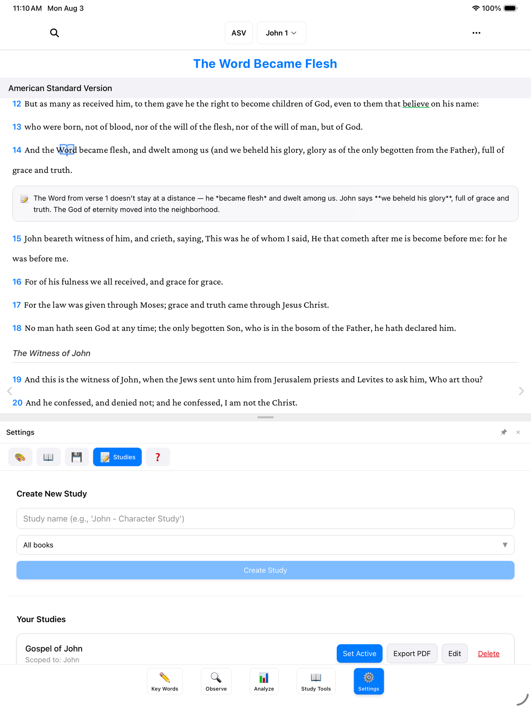
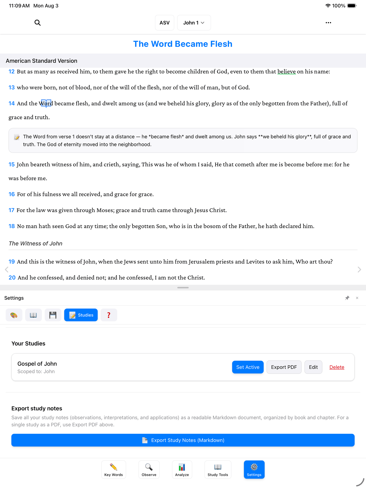

A study in BibleMarker is like a named notebook. Everything you do while a study is active — the key words you mark, the observations you jot down — is kept inside that notebook. When you finish the Gospel of John and start Romans, you can open a fresh notebook and begin with a clean page, while everything from John stays safely where you left it.

A study can also be tied to a single book of the Bible, so your John notebook stays about John. And only one study is active at a time — whichever notebook is open on your desk, so to speak.

> **Don't worry:** You don't have to create a study to use BibleMarker. You can mark words and take notes without one. A study just helps keep things tidy once you're working through more than one book.

## Create a study

1. Tap the **Settings** button (⚙️) — the last of the five buttons along the bottom of the screen.
2. Tap **Studies**.
3. Tap **Create New Study**.
4. Give it a name — something like "Gospel of John."
5. Choose a book, if you'd like. The book picker starts on **All books**, which means the study isn't tied to any one book. To keep this notebook about one book, pick it here — for example, John.

   

6. Save it, and your new study appears in the list.

> **Tip:** Not sure which book to pick? Leave it on **All books**. You can always change it later by tapping **Edit** next to the study.

## Make it active

Creating a study doesn't open it — you also need to make it the active one. In the same **Studies** list, find your study and tap **Set Active**. That's it: your new notebook is now the open one, and everything you mark from here on goes into it.

Each study in the list has four buttons:

- **Set Active** — open this notebook and start working in it.
- **Export PDF** — turn the study into a PDF you can print or share.
- **Edit** — change the study's name or its book.
- **Delete** — remove the study. The app will ask you to confirm first, so you won't lose anything by accident.

Switching between studies works the same way: come back to **Settings** → **Studies** and tap **Set Active** on a different one. Nothing is lost when you switch — each notebook keeps its own contents, waiting for you to come back.

## How a study affects your key words

When a study is active, the key words you create belong to that study. And if the study is tied to one book — say, John — your new key words are marked in that book, keeping the rest of your Bible clean.

When no study is active, key words you create go to "All Studies" instead — a shared, general notebook. That works fine too; it's simply less organized once you have several books going.

> **Tip:** If you open a key word and the form mentions "All Studies," that's just BibleMarker telling you no study notebook is currently open.

## Where to go next

- [Marking Key Words](/docs/marking-keywords/) — now that your notebook is ready, mark your first word in it.
- [Getting Started](/docs/getting-started/) — a refresher on the five buttons along the bottom.
