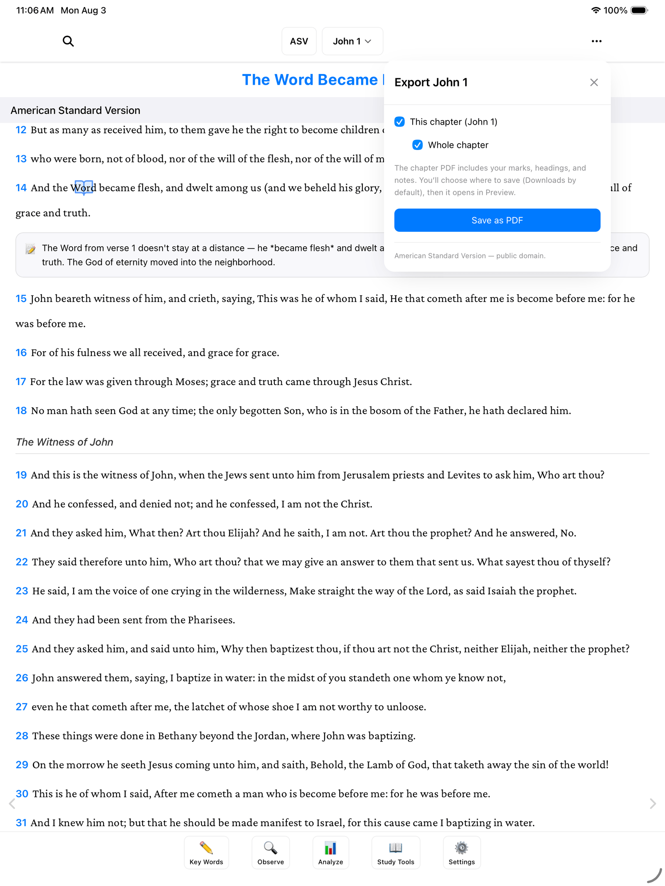

Everything you mark and write in BibleMarker stays safely in the app — but it doesn't have to stay there. Think of this as the copy machine: you can make a copy of your marked-up chapter or your study notes and take it anywhere. Print it out, email it to a friend, or bring it to your study group. Making a copy never changes the original — your work in the app stays exactly as it is.

There are three ways to do it, and this guide walks through each one.

## Save a chapter as PDF

This makes a PDF of the chapter you're reading — with all your colored marks, your headings, and your notes right on the page, just the way it looks on screen.

1. Open the chapter you want to save.
2. Tap the **⋯** button at the top right of the screen.
3. Tap **Export page…**. A small window opens — for John 1, it's titled "Export John 1."
4. You'll see two checkboxes: **This chapter (John 1)** and **Whole chapter**. Leave them as they are, or adjust to taste.
5. Tap **Save as PDF**.

As the window explains: the chapter PDF includes your marks, headings, and notes. You'll choose where to save it — your Downloads folder is suggested — and then it opens so you can see it right away.

At the bottom of the window you'll also see a small note crediting the translation, such as "American Standard Version — public domain." That stays on the PDF, so anyone you share it with knows which Bible they're reading.

> **Tip:** Once you have the PDF, printing it works like printing anything else on your device. A printed, marked-up chapter is lovely to bring to a group study — or to hand to a friend who still prefers paper.

## Save a study as PDF

If you want a copy of a whole study — all the observations you've gathered, not just one chapter — you can export the study itself:

1. Tap **Settings** (⚙️), the last of the five buttons along the bottom of the screen.
2. Tap the **Studies** tab.
3. Tap the study you want.
4. Tap **Export PDF**.

That saves a PDF of that study's observations. (If you haven't set up a study yet, the [Create a Study](/docs/create-a-study/) guide shows you how.)

## Save everything as a text document

There's one more option, and it's a good one for peace of mind: saving all your study notes — your observations, interpretations, and applications — as one readable document, organized by book and chapter.

1. Tap **Settings** (⚙️), then the **Studies** tab.
2. Scroll to the section called **Export study notes**.
3. Tap **Export Study Notes (Markdown)**.

"Markdown" is just the name of the format — in plain terms, it's a simple text document that any computer can open, now or decades from now. No special app required. If you like keeping a paper trail (or a digital one), this is the closest thing to photocopying your whole study notebook.

> **Don't worry:** Exporting makes copies — it never moves or removes anything. Your marks and notes stay right in the app, untouched.

## Where to go next

- [Settings & Backups](/docs/settings-and-backups/) — keep your work safe with automatic backups.
- [Accounts & Sync](/docs/accounts-sync/) — see your same study on all your devices.
