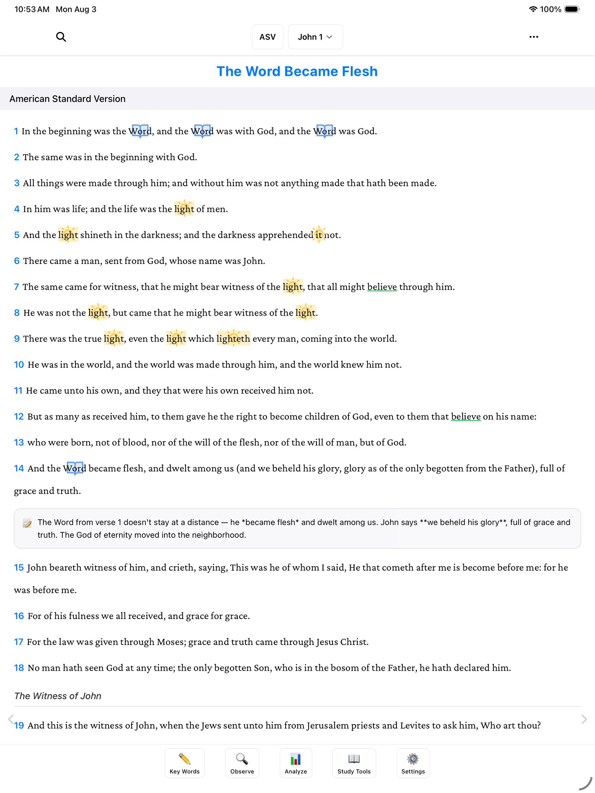
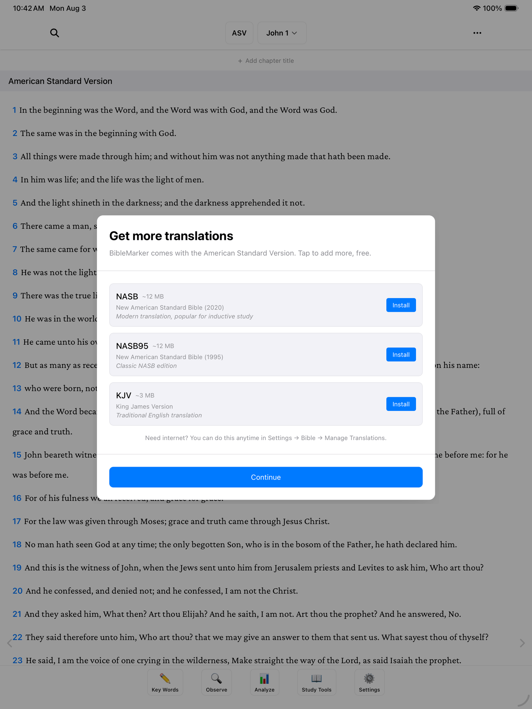
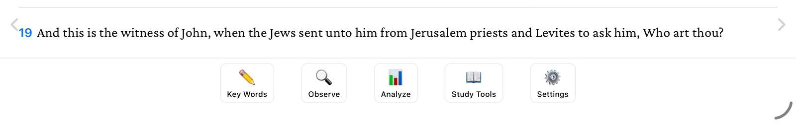
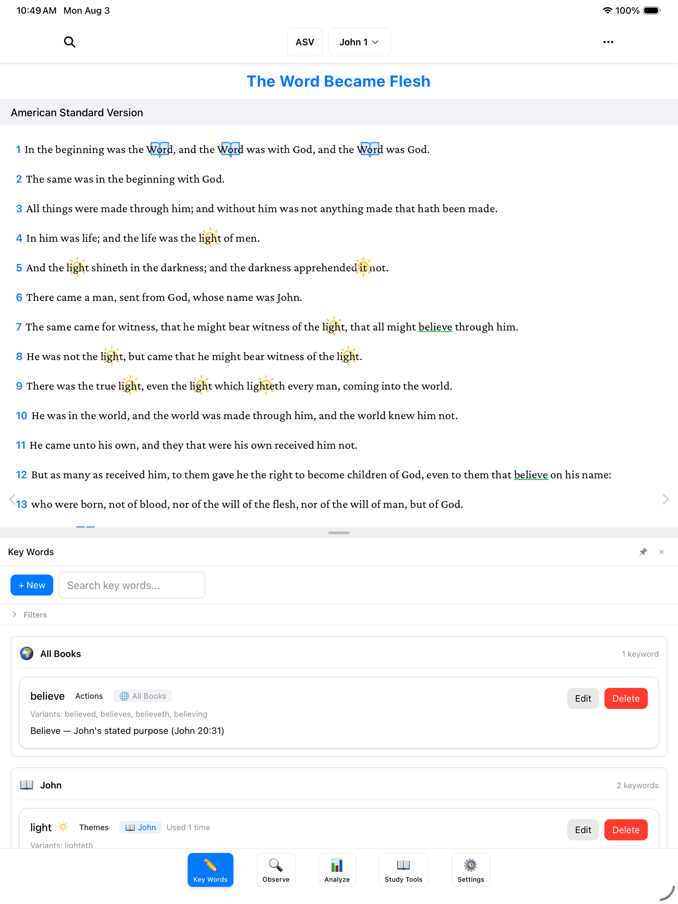
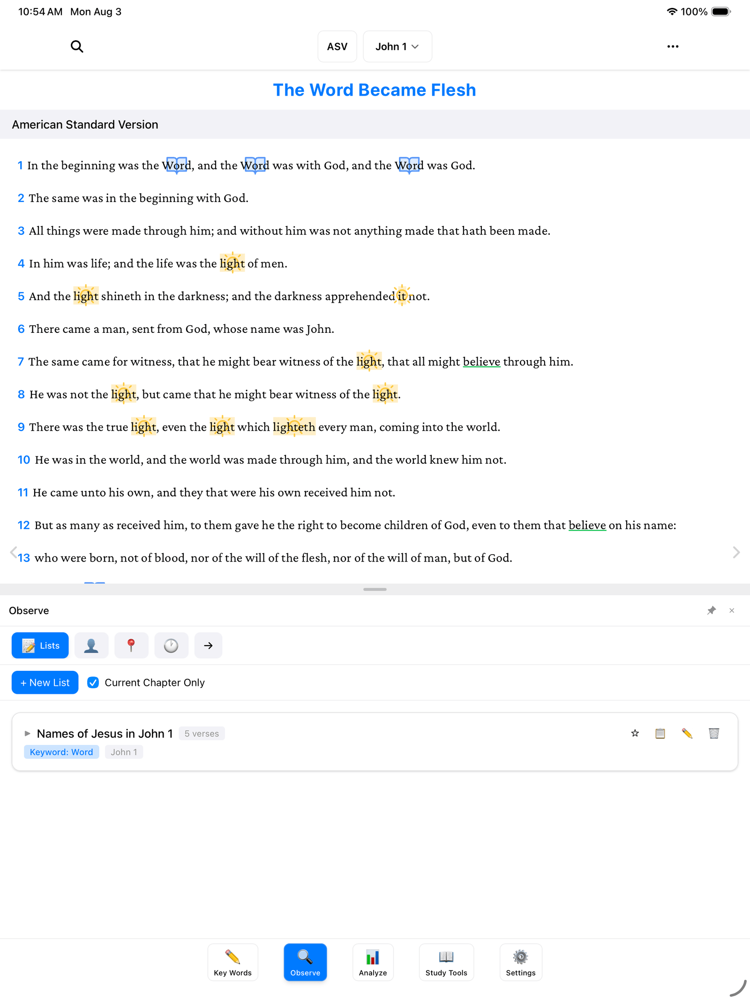

Welcome to BibleMarker. If you've ever studied the Bible with colored pencils and a highlighter, this will feel familiar — it does the same thing, right here on your screen. You mark the words you notice — the ones that repeat, the people, the places — and BibleMarker keeps track of it all for you.

> **Don't worry:** Nothing you do here is permanent, and you can't break anything. Every mark can be changed or removed later, and if you ever tap the wrong thing, just tap **Cancel**.

## The reading view

When you open BibleMarker, you'll see a chapter of scripture. This is the reading view — think of it as the open page of your Bible. It's where you'll spend most of your time.

To move to a different book or chapter, tap the book and chapter name at the top of the screen. A picker opens — choose any book, then any chapter, and you're there.

### Bible translations

BibleMarker comes with the **ASV** (American Standard Version) already included. It works completely offline — no internet needed, ever.

When you first open the app, you'll also be offered two free downloads: the **NASB 2020** and the **NASB 1995**. If you skipped that the first time, you can get them anytime by going to **Settings** and tapping **Bible**.

You can even show up to three translations side-by-side — handy for comparing how different translators worded the same verse.

## The five buttons along the bottom

Everything in BibleMarker lives in the row of five buttons along the bottom of the screen. Here's what each one does.

1. **Key Words** (✏️) — This is where you keep your key words: the important words you want to follow through a passage, each with its own color. It's like your box of colored pencils, and it's the button you'll use most.

   

2. **Observe** (🔍) — This is your notebook. It's where you jot down what you're noticing about the people, the places, the timing, and how the passage flows.

   

3. **Analyze** (📊) — This brings it all together: a big-picture view of the book you're studying, and room to write down what it means to you.

4. **Study Tools** (📖) — Like having study books on the shelf. Look up related verses and the original Hebrew and Greek words whenever you're curious.

5. **Settings** (⚙️) — Where you make things comfortable: make the text bigger, download Bible translations, and keep a backup of your work so it's always safe.

> **Tip:** If you're using BibleMarker on a computer, the number keys 1 through 4 jump straight to the first four buttons — 1 for **Key Words**, 2 for **Observe**, 3 for **Analyze**, and 4 for **Study Tools**.

There's no wrong way to explore. Tap around, and if you ever land somewhere unexpected, just tap one of these five buttons to come back.

## Where to go next

Two good next steps, in whichever order suits you:

- [Create a Study](/docs/create-a-study/) — set up a named notebook for the book you're studying.
- [Marking Key Words](/docs/marking-keywords/) — mark your very first word, step by step.
