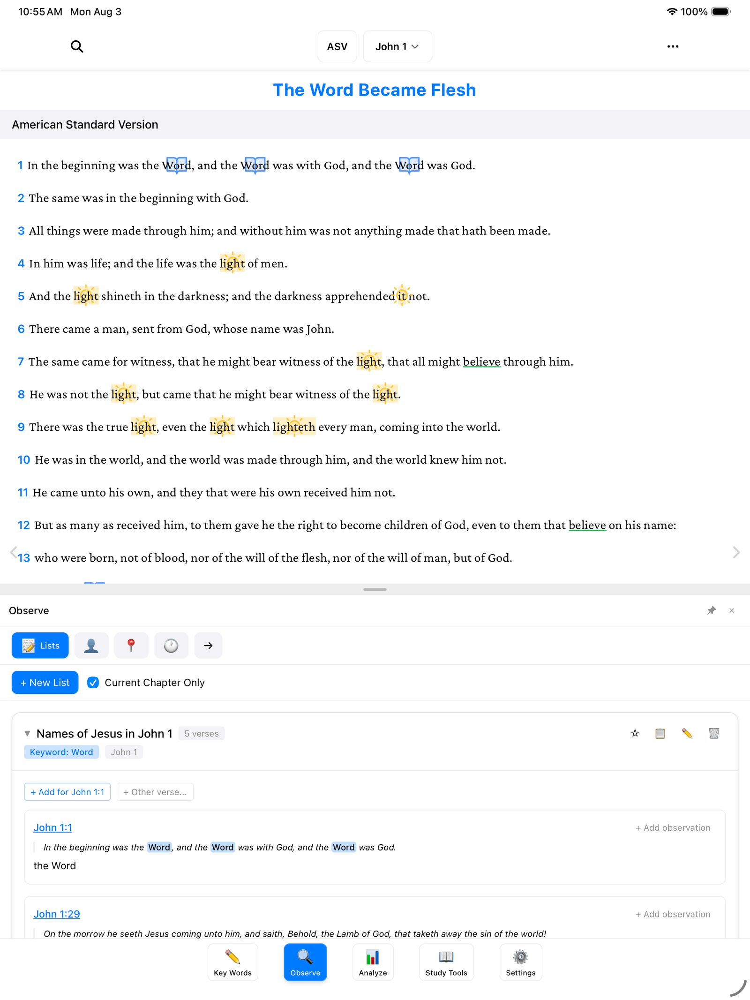
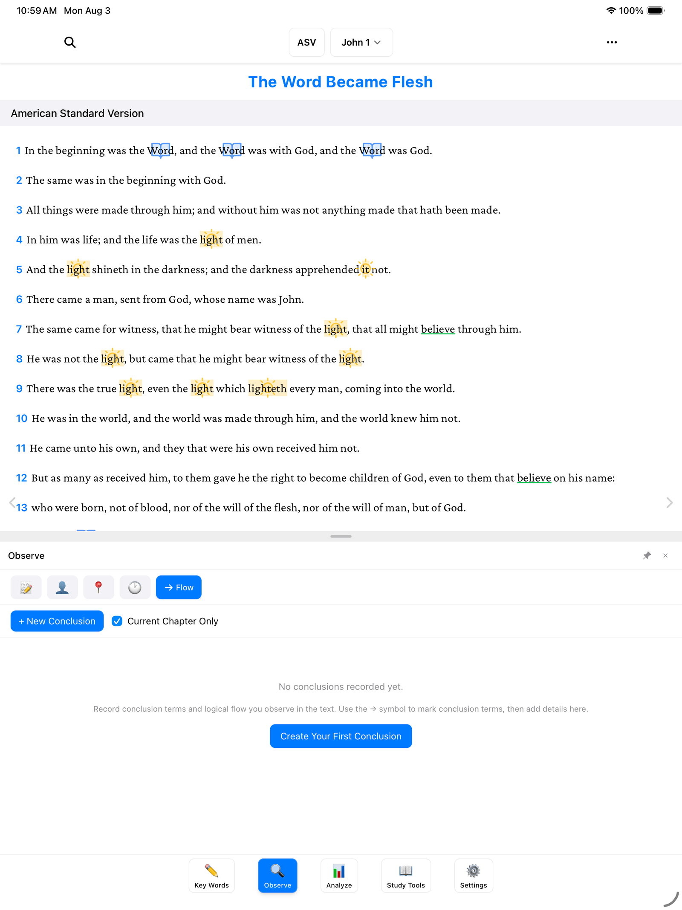

If you've ever studied with a notebook open beside your Bible, you know the habit: as you read, you keep a running list in the margin — every name Jesus is called, everything a passage says about love. BibleMarker's **Lists** tab is that margin, and it never runs out of room. And when the text draws a conclusion — a "therefore," a "so that" — the **Flow** tab gives you a place to write down where the argument is going.

Both live in the **Observe** panel: tap **Observe** (🔍), the second of the five buttons along the bottom of the screen. **Lists** is the first tab in the row across the top; **Flow** is the last.

> **Don't worry:** Lists are just collections of notes. You can rename them, add to them, or remove entries any time — nothing is set in stone.

## What a list is

A list is a simple question you keep asking as you read. Take John chapter 1 and ask: *what is Jesus called here?* The Word. The Lamb of God. Rabbi. The Son of God. The King of Israel. Each answer becomes an entry in a list called "Names of Jesus in John 1."

Tap a list to open it, and you'll see every entry with its verse — the noted phrase highlighted right in the verse text, so each one stays in context.

## Make a list and add to it

The natural way to build a list is straight from the text, as you read:

1. In the reading view, drag your finger across the phrase you want to keep — "the Lamb of God," for example.
2. A little menu appears. Tap **Observe**.
3. Choose the list it belongs to — or create a new one right there, with a name like "Names of Jesus in John 1."
4. The phrase and its verse are added to the list. Keep reading; when you spot the next one, do it again.

You can also tap the **verse number** at the start of a verse and choose **Add Observation** — handy when the whole verse belongs on the list. And from the Lists tab itself, the **+ New List** button starts an empty list you can fill as you go.

> **Tip:** The **Current Chapter Only** checkbox near the top shows just the entries from the chapter you're reading — useful once your lists start to grow.

There's no limit and no wrong topic. "Everything light does." "Commands in this chapter." "Promises to believers." If you'd write it in a margin, it belongs in a list.

## The Flow tab

Now for the last tab in the row: **Flow**. This one is about the *logic* of a passage — the moments where the writer stops describing and starts concluding. Watch for little words like **therefore**, **so that**, **for this reason**. Whenever you see one, it's worth pausing to ask: *what came before, and what follows from it?*

The first time you open Flow, it will be empty, with a friendly nudge: "No conclusions recorded yet. Record conclusion terms and logical flow you observe in the text. Use the → symbol to mark conclusion terms, then add details here."

Here's the idea:

1. As you read, when you hit a conclusion word like "therefore," mark it in the text with the **→** symbol — a little arrow that says *this points somewhere*. (Symbols are part of marking key words; see [Marking Key Words](/docs/marking-keywords/) if you haven't done that yet.)
2. Then open the **Flow** tab and tap **Create Your First Conclusion** (or **+ New Conclusion**, once you have a few).
3. Write out the conclusion in your own words — what the "therefore" is there for.

Think of it as the arrows you'd draw in a paper Bible's margin, connecting a truth to what it leads to — except here, your notes about each arrow are kept together in one place.

## What's next

- [People, Places & Time](/docs/people-places-time/) — the other three tabs in the Observe panel.
- [The Analyze Tab](/docs/analyze/) — where your lists and observations come together into the big picture.
