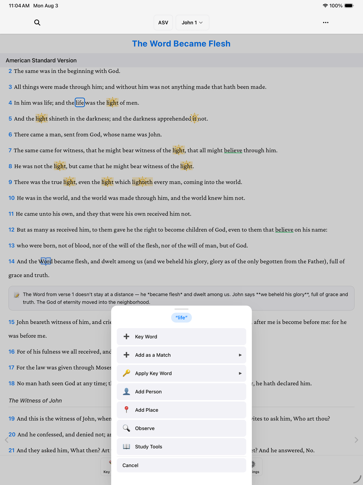
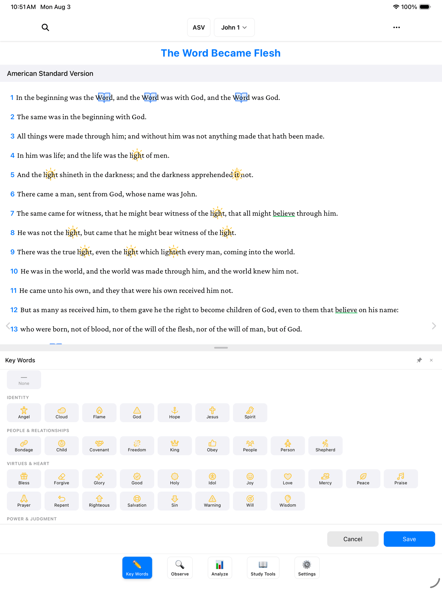
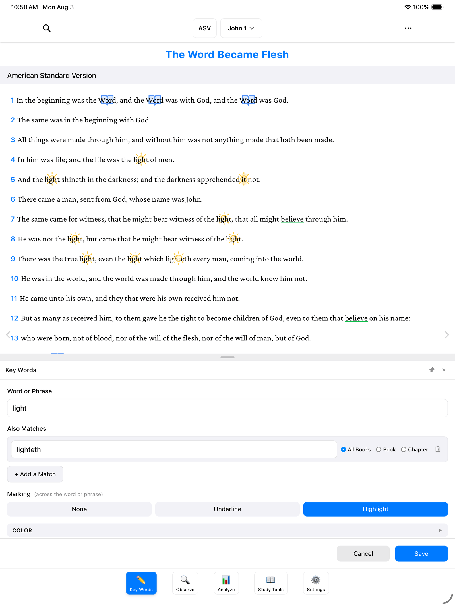
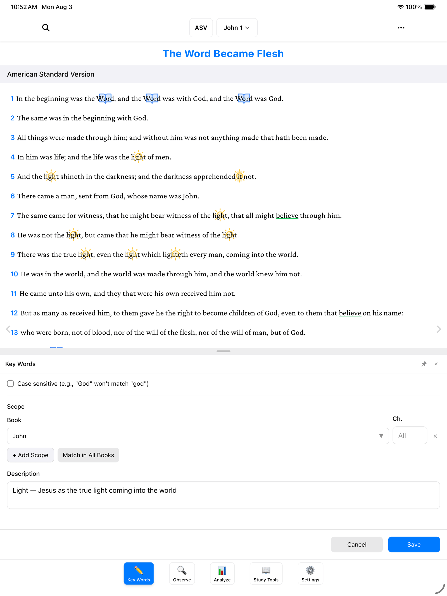
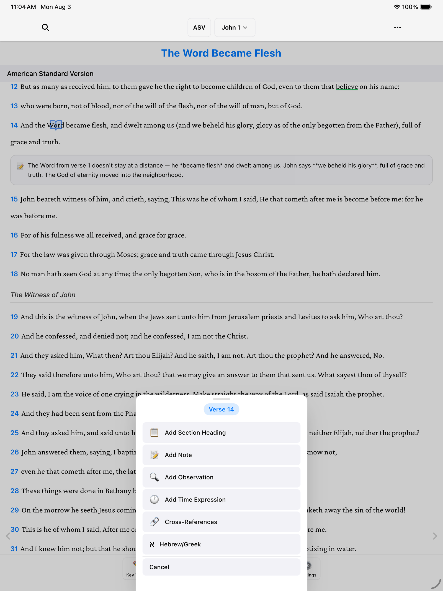
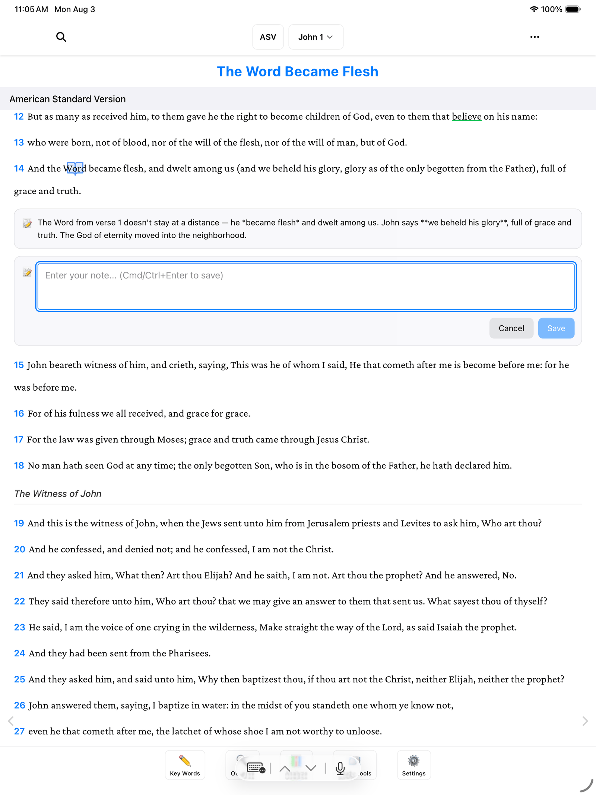

Marking a key word is the main thing you'll do in BibleMarker. A key word is a word you want to follow through a passage — usually one that repeats, like "light" in John 1. Once you mark it, BibleMarker colors it the same way everywhere it appears, just like going through the page with a colored pencil — except the app does the coloring for you.

Let's do one together, step by step.

> **Don't worry:** Nothing here is set in stone. Every color, symbol, and mark can be changed later, and if you tap the wrong thing, just tap **Cancel**.

## Mark your first key word

1. Find a word you want to follow. We'll use the word "light" in John 1.
2. Press and hold the word, then let go. If you want a phrase instead of a single word, drag your finger across all the words first. A little menu appears with the word shown at the top.

   

3. Tap **Key Word**. A form opens — and notice the word is already filled in for you under **Word or Phrase**. You don't have to type anything.

   

4. Choose how it should look. Under **Marking**, tap **Highlight** — just like a highlighter pen. You could also pick **Underline**, or **None** if you'd rather mark it only with a symbol.
5. Pick a color you like. Gold suits "light" nicely.
6. If you'd like, give it a **Symbol** — a small picture that sits on the word, like a little sun. The symbol picker is organized into categories, and there's a search box if you know what you're looking for. This step is optional — skip it if you'd rather not.

   

7. Tap **Save**.

And there it is — every place the word "light" appears is marked, all at once. You marked it one time; BibleMarker did the rest.

## Catch other forms of the word

Sometimes the same word shows up in a slightly different form — older translations might say "lighteth" where you marked "light." Here's how to tell BibleMarker they belong together:

1. Press and hold the other form of the word (for example, "lighteth").
2. In the little menu, tap **Add as a Match**.
3. Pick which key word it belongs to — in our case, "light."

Now both forms are marked the same way, everywhere they appear. If you open the key word later, you'll see the extra form listed under **Also Matches**.

## Mark pronouns with Apply Key Word

Sometimes a small word like "it" or "him" is pointing back to your key word — "it" meaning the light, for instance. You wouldn't want every "it" in the Bible marked gold! So BibleMarker gives you a way to mark just one spot:

1. Press and hold the pronoun — say, the word "it."
2. Tap **Apply Key Word**.
3. Choose the key word it refers to.

That marks only this one selected spot. Every other "it" in the Bible is left alone.

> **Which button do I tap?** The little menu has three choices that sound alike, so here they are side by side:
>
> - **Key Word** — create a brand-new key word. Every occurrence of the word gets marked automatically.
> - **Add as a Match** — teach an existing key word another form of the word (like "lighteth" for "light"). All of those get marked too.
> - **Apply Key Word** — mark just this one selected spot. Use it for pronouns like "it" or "him" that point back to your key word.
>
> And if you ever pick the wrong one, just tap **Cancel** — nothing happens until you save.

## Edit a key word later

All your key words live behind the **Key Words** button (✏️) — the first of the five buttons along the bottom of the screen. Tap it to see the list, then tap any key word to open it back up. Change the color, swap the symbol, add more matches — anything you set before, you can change now. Tap **Save** when you're happy.

## Keep a key word to one book

Near the bottom of the key word form is a section called **Scope**. That's the app's word for "where should this key word be marked?" Out of the box it says **Matches in all books** — meaning the word is marked everywhere in the Bible.

If your word only matters in the book you're studying, tap **+ Add Scope** and choose the book — for example, John. Now "light" is only marked in John, and the rest of your Bible stays clean.

> **Tip:** You can always come back and change this. Widen it to all books or narrow it to one — your marks adjust automatically.

## Notes and headings on verses

Marking words isn't the only way to capture what you're seeing. You can also write in the margin, so to speak:

1. Tap the verse number at the start of any verse. A small menu appears.

   

2. Tap **Add Note** to jot down a thought about that verse — like a sticky note attached right where you need it. Write what you like and save it.

   

3. Or tap **Add Section Heading** to give a stretch of verses your own title — the way study Bibles put a heading above each section, except these are yours.

> **Tip:** Notes understand a simple formatting style called Markdown — for example, putting `**stars**` around a word makes it **bold**. But plain sentences work perfectly well; you never have to use it.

That's the whole thing: mark a word, give it a color, catch its other forms and its pronouns, and decide where it should appear. Do this a few times and it'll feel like second nature.

## Where to go next

- [Create a Study](/docs/create-a-study/) — keep your key words organized in a named notebook for each book you study.
