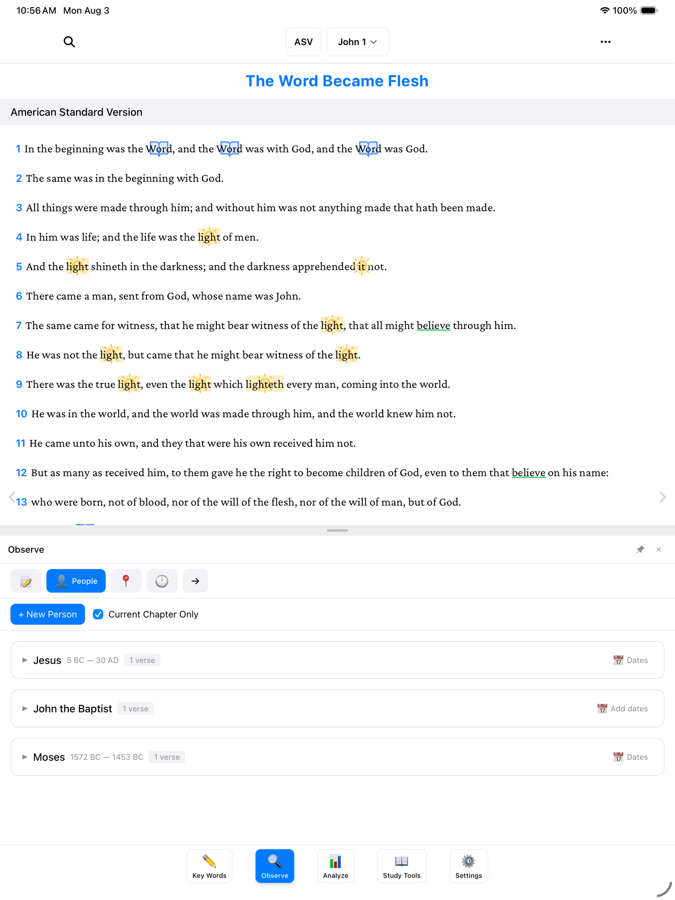
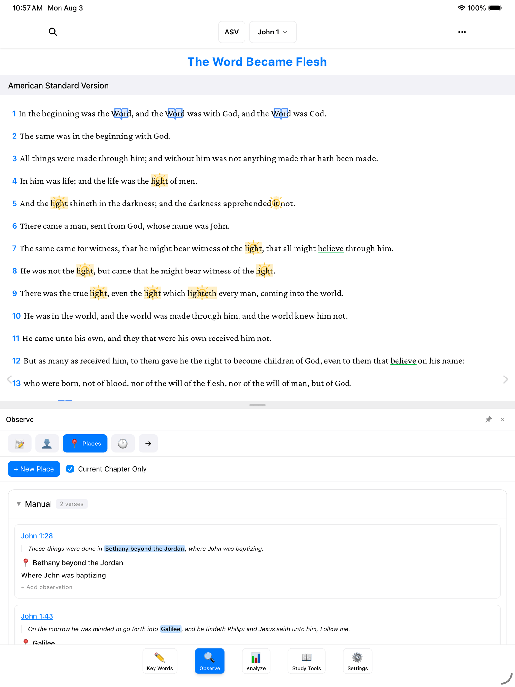
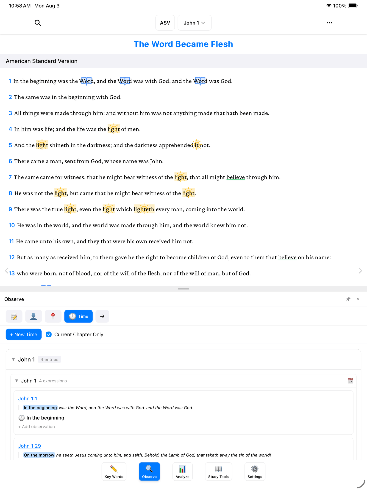

Good Bible study starts with simple questions: *Who is here? Where are they? When is this happening?* If you've ever kept those answers in the margin of a notebook, BibleMarker gives each one its own page — a running list of the people, the places, and the time expressions you notice, with every verse gathered underneath.

> **Don't worry:** You can't break anything here. Every entry can be renamed or removed later, so add things freely as you notice them.

## Open the Observe panel

Tap **Observe** (🔍) — the second of the five buttons along the bottom of the screen. A panel opens with a row of tabs across the top: **Lists**, **People**, **Places**, **Time**, and **Flow**. This guide covers the middle three. (Lists and Flow have [their own guide](/docs/lists-and-flow/).)

> **Tip:** On a computer, pressing the number **2** opens the Observe panel straight away.

Each of these three tabs works the same way, so once you've learned one, you've learned them all.

## The People tab

Tap **People**. This is your list of everyone who appears in the text — like a cast of characters you're building as you read.

To add a person straight from the text:

1. In the reading view, drag your finger across the person's name — "John the Baptist," for example.
2. A little menu appears. Tap **Add Person**.
3. That's it. The person now appears in the People tab, along with the verse you found them in.

You can also add someone by hand: in the People tab, tap the **+ New Person** button. This is handy for a person the text only hints at, or one you want to note before you've selected anything.

Each person's entries are grouped by chapter, and every entry shows the verse text with the name highlighted — so you can see them at a glance, in context. For people like Jesus, you can even record dates (5 BC — 30 AD), which come in handy later on the timeline.

> **Tip:** See the **Current Chapter Only** checkbox near the top? Tick it to show only the entries from the chapter you're reading. Untick it to see the whole book at once.

## The Places tab

Tap **Places**. Same idea, but for geography — everywhere the passage takes you.

1. Drag across a place name in the text — "Bethany beyond the Jordan," say.
2. Tap **Add Place** in the menu.
3. The place appears in the Places tab with its verse — John 1:28, "Where John was baptizing."

Or tap **+ New Place** in the tab to add one by hand. As you keep reading and adding, you'll watch the journey take shape — from Bethany beyond the Jordan to Galilee and onward.

## The Time tab

Tap **Time**. This one collects the little phrases that tell you *when* — words like "In the beginning" or "On the morrow." They're easy to read right past, but they're the hinges the story turns on.

Time expressions are usually attached to a whole verse, so the steps are a touch different:

1. Tap the **verse number** at the start of the verse.
2. Tap **Add Time Expression** in the menu.
3. The phrase appears in the Time tab with its verse.

(You can also tap **+ New Time** in the tab to add one by hand.) Notice in John 1 how "On the morrow" appears again and again — verses 29, 35, and 43. Gathered in one list, you can suddenly see it: John is walking you through this story one day at a time.

## What's next

Once you've gathered your people, places, and times, two good next steps:

- [Lists & Flow](/docs/lists-and-flow/) — the other two tabs in the Observe panel.
- [The Analyze Tab](/docs/analyze/) — where your places and dates come together on maps and timelines.
