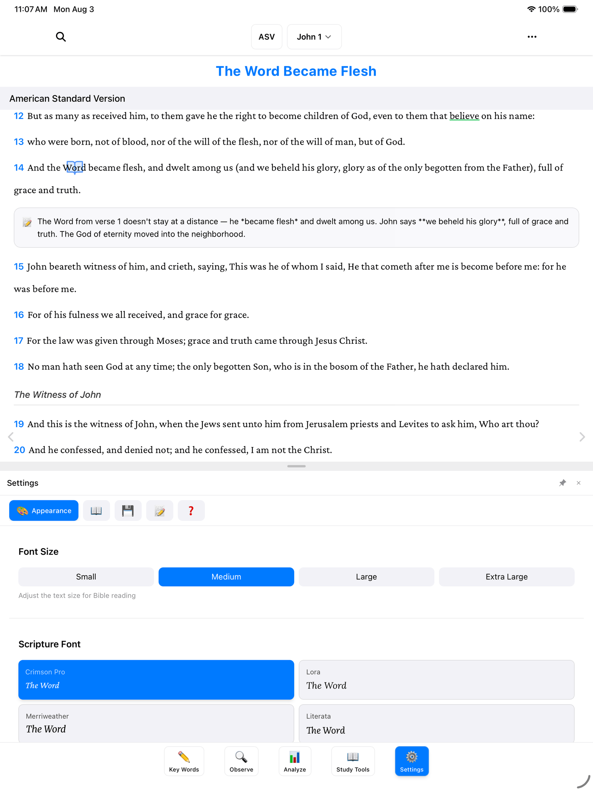
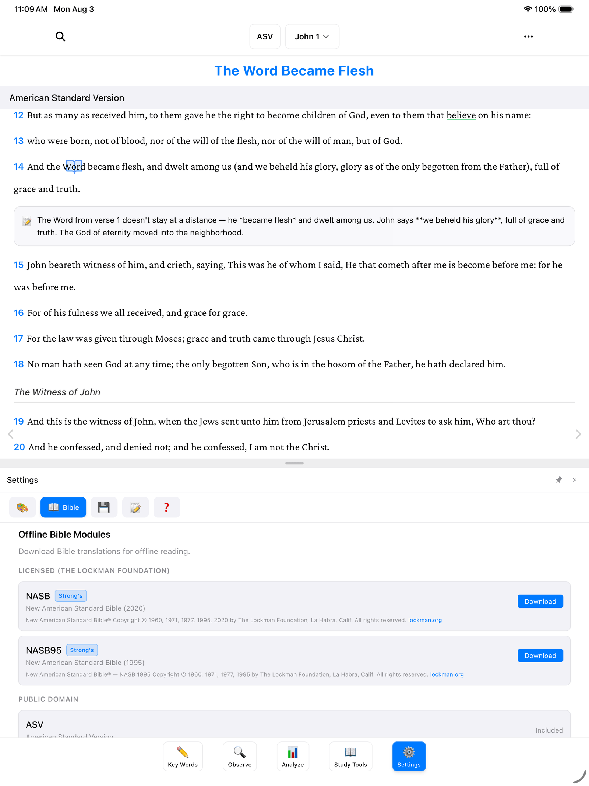
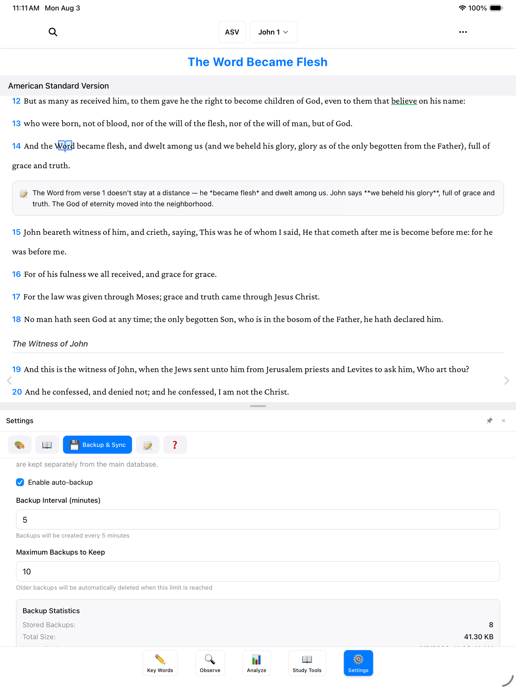

**Settings** is where you make BibleMarker comfortable for you — bigger text, a font you like, light or dark colors — and where the app quietly keeps your work safe. To open it, tap **Settings** (⚙️), the last of the five buttons along the bottom of the screen.

Across the top of the Settings panel you'll see five tabs: **Appearance** 🎨, **Bible** 📖, **Backup & Sync** 💾, **Studies** 📝, and **Help** ❓. Let's look at the ones you'll use most.

> **Don't worry:** Nothing in Settings is permanent. Try any option, and if you don't like it, change it right back.

## Make it comfortable

The **Appearance** tab is all about easy reading.

- **Font Size** — choose **Small**, **Medium**, **Large**, or **Extra Large**. If you find yourself squinting, pick a bigger one. That's what it's there for.
- **Scripture Font** — pick the typeface the Bible text is printed in: **Crimson Pro**, **Lora**, **Merriweather**, or **Literata**. All four are designed for comfortable long reading; choose whichever your eyes like best.
- **Theme** — **Dark**, **Light**, or **Auto**. Light is dark text on a light page, like a printed book. Dark is easier on the eyes in a dim room. **Auto** follows your device, switching on its own as day turns to evening.

Further down are options for the little symbols on your marked words — where they sit, how big they are, and whether they show at all.

## Bible translations

The **Bible** tab is where your translations live — like choosing which Bibles sit on your shelf.

Near the top you can narrow the list by language, and pick your **Default Translation** — the one that opens when you start the app.

Below that is **Offline Bible Modules**, where you can download Bible translations for offline reading. Once a translation is downloaded, it works with no internet at all — on an airplane, at a cabin, anywhere. The list is in two sections:

- **Licensed (The Lockman Foundation)** — the **NASB (2020)** and **NASB95**, both free downloads with Strong's numbers included. Tap **Download** next to either one and it's yours.
- **Public Domain** — older translations that are free for everyone. The **ASV** (American Standard Version) is marked **Included** — it comes with the app and works offline right out of the box. Others, like the **KJV** (with Strong's numbers), **BBE**, **BSB**, and **Darby**, each have their own **Download** button.

One more option for those who want it: the **ESV** is available too, using a free key from Crossway, the ESV's publisher. You'll find the **ESV API** section on this same Bible tab, with instructions for requesting the key on Crossway's website.

## Keep your work safe

Here's the most reassuring part of this whole guide: **BibleMarker is already backing up your work automatically.** You don't have to do anything — but it's worth knowing where the safety net is.

Tap the **Backup & Sync** tab. It has three sections:

**Automatic backups.** The **Enable auto-backup** checkbox is on by default, and the app quietly saves a snapshot of your work every 5 minutes (**Backup Interval**), keeping the 10 most recent (**Maximum Backups to Keep**). You can change both numbers, but the settings out of the box serve most people well. Below that, **Backup Statistics** and a list show every stored backup, each with its own **Restore** button — like a filing cabinet of dated copies you can reach back into. There's also a **Create Backup Now** button if you'd like a snapshot this very moment, perhaps right before trying something new.

**Save a backup file.** For extra peace of mind, tap **Export Data Backup (JSON)** — JSON is just the name of the file format — to save a single file containing everything — your marks, notes, and studies — anywhere you like: a folder on your computer, a thumb drive, an email to yourself. To bring it back (or move to a new device), tap **Restore from Backup** and choose that file.

**Sync across devices.** If you use BibleMarker on more than one device — say, an iPad and a computer — sync keeps them all showing the same work. It uses a simple sign-in with your email and an 8-digit code; the [Accounts & Sync](/docs/accounts-sync/) guide walks through it step by step.

> **Tip:** Backups protect one device; sync protects you across devices. Using both means your study is about as safe as it can be.

## Where to get help

The **Help** tab is worth remembering. It gathers the **Getting Started** guide and the list of **Keyboard Shortcuts**, and shows which version of the app you have — with a button to check for updates. If something ever seems off, this is a good first stop.

## Where to go next

- [Accounts & Sync](/docs/accounts-sync/) — set up sync so your study follows you everywhere.
- [Keyboard Shortcuts](/docs/keyboard-shortcuts/) — a one-page list for computer users.
