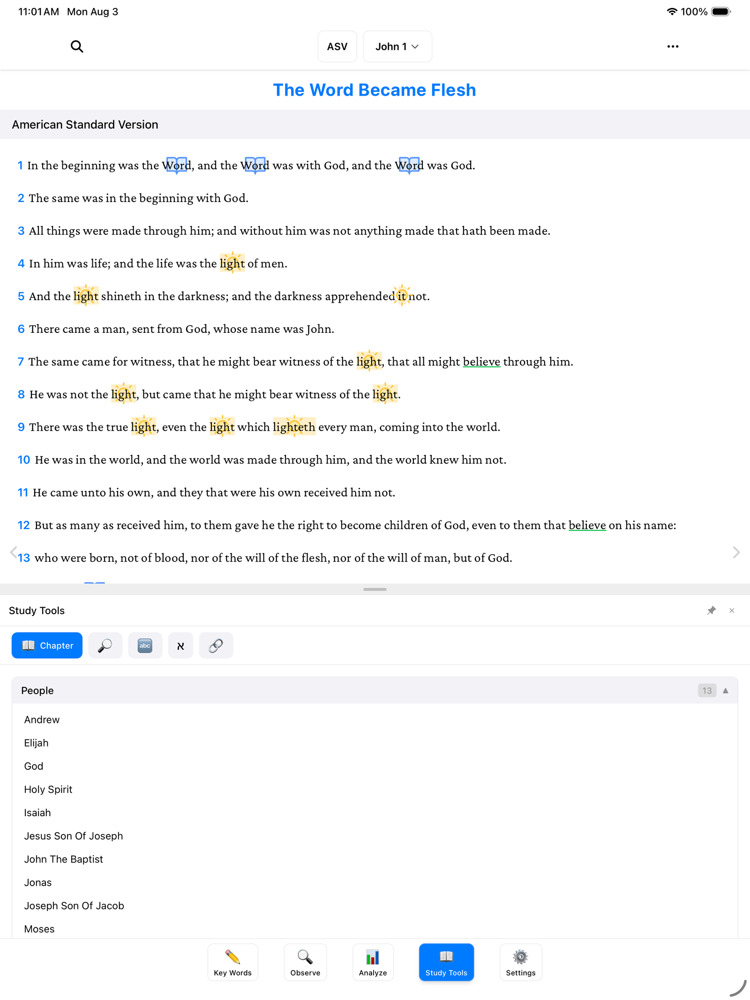
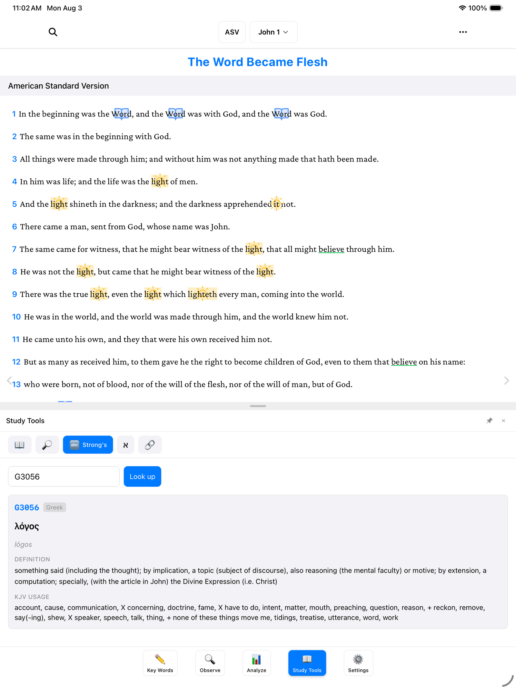
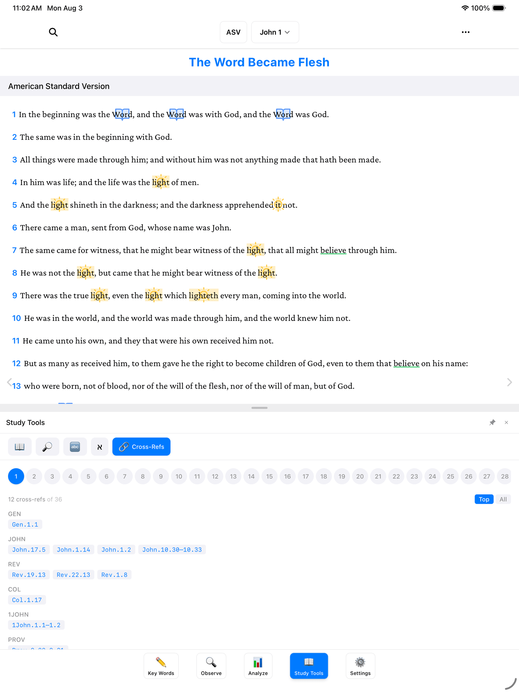
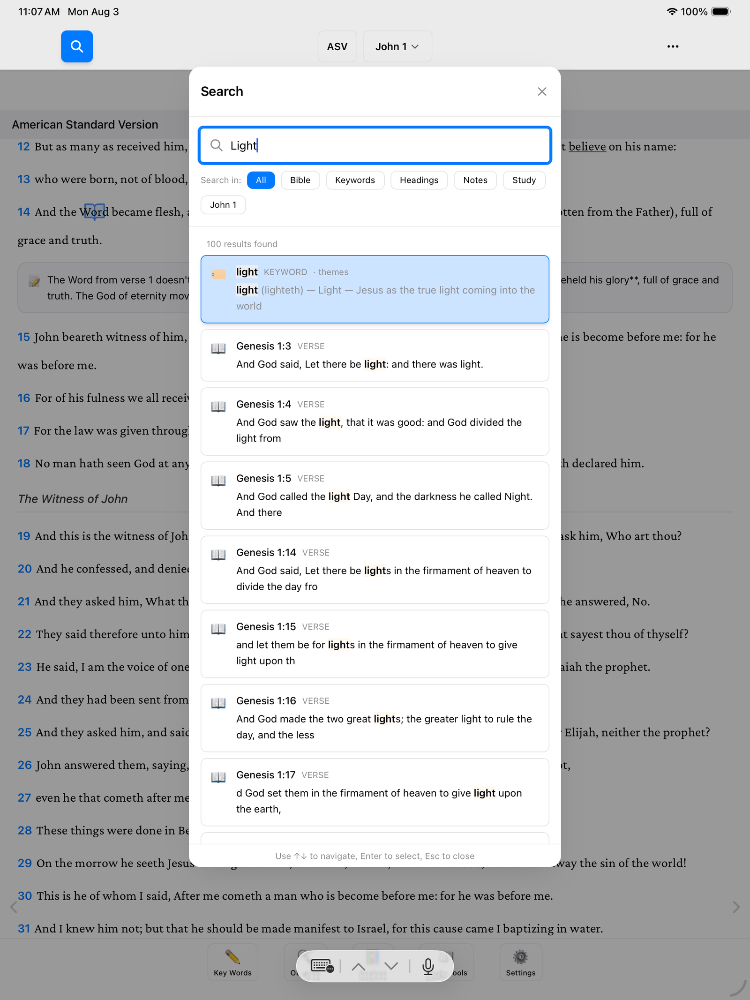

If you've ever kept a shelf of study books next to your Bible — a concordance, a Bible dictionary, a book of cross-references — this guide is for you. **Study Tools** is that whole shelf, built right into the app. Everything here works offline, and nothing you do in this panel changes your marks or notes. You're just looking things up, the same as pulling a book off the shelf.

To open it, tap **Study Tools** (📖) — the fourth of the five buttons along the bottom of the screen. Across the top of the panel you'll see a row of tabs: **Chapter**, **Search**, **Strong's**, **Hebrew/Greek**, and **Cross-Refs**. We'll walk through them one at a time.

> **Tip:** On a computer, pressing the number key **4** opens Study Tools instantly.

## Who's in this chapter

The first tab, **Chapter**, answers a simple question: who and what appears in the chapter you're reading right now? The app checks its built-in reference library and lists them for you — no typing needed.

For example, open John 1 and the **People** list shows 13 names — Andrew, Elijah, God, Holy Spirit, Isaiah, Jesus, and more. Tap any name to read a short description of who they are. It's like having a Bible dictionary that already turned to the right page for you.

This is a nice companion to your own observations — after you've noted the people you spotted yourself, compare with this list to see if you missed anyone. (For keeping your own notes on people, see [People, Places & Time](/docs/people-places-time/).)

## Look up the original word

The Bible was written in Hebrew and Greek, and sometimes it helps to see the word behind the English. That's what the **Strong's** tab is for. Strong's numbers are a filing system scholars have used for over a century: every original word has a number, like a call number in a library.

Here's how to look one up:

1. Tap the **Strong's** tab.
2. Type a number in the box — for example, **G3056**. (The G means Greek; an H would mean Hebrew.)
3. Tap **Look up**.

G3056 is *lógos* (λόγος) — the word behind "Word" in "In the beginning was the Word." You'll see the Greek spelling, how it's pronounced, what it means, and how the King James Version translated it in other places.

> **Tip:** Don't worry if you don't know any Strong's numbers yet. Study Bibles, concordances, and many websites list them next to each word — and once you have a number, this tab does the rest.

## Verses that connect

Scripture explains scripture — one verse often echoes another written centuries apart. The **Cross-Refs** tab helps you follow those threads.

1. Tap the **Cross-Refs** tab. You'll see a row of buttons, one for each verse in the current chapter.
2. Tap a verse number to see cross-references for that verse.

Tap verse **1** in John 1, for example, and you'll see related verses grouped by book — Genesis 1:1, Revelation 19:13, Colossians 1:17, 1 John 1:1–2, and more. It's the margin-notes column from a study Bible, without the tiny print.

## Search everything

There's one more research tool, and it lives at the top of the screen rather than in the panel: the magnifying glass at the top left. Tap it (or press **Cmd+F** on a Mac, **Ctrl+F** on Windows) and type anything.

Search looks through everything at once — the Bible text, your key words, your headings, your notes, and your studies. Results show your matching keyword cards and verses with your search term highlighted, so it's easy to spot.

A few things that make it especially handy:

- **Filter chips.** Below the search box you'll see chips labeled **All**, **Bible**, **Keywords**, **Headings**, **Notes**, and **Study**. Tap one to narrow the results to just that kind of thing. There's also a chip to limit results to the chapter you're reading.
- **Jump to a verse.** Type a reference like "John 3:16" and the app takes you straight there — often faster than the book-and-chapter picker.

> **Don't worry:** Searching never changes anything. Look up as much as you like — your marks and notes stay exactly as you left them.

## Where to go next

- [Export & Share (PDF)](/docs/export-and-share/) — turn your marked-up chapter into a page you can print or share.
- [The Analyze Tab](/docs/analyze/) — step back and see the big picture of the book you're studying.
